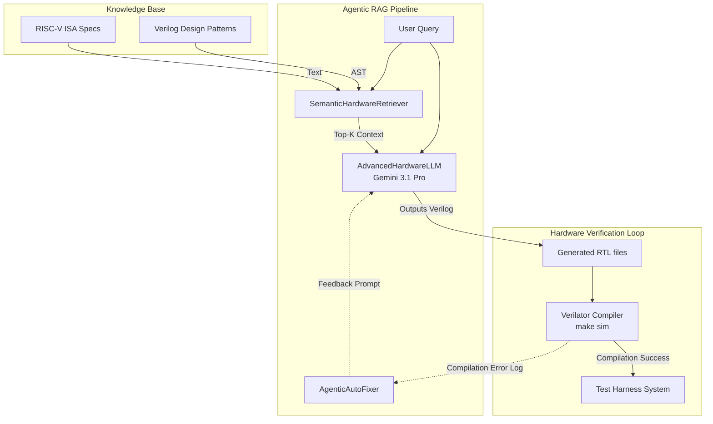
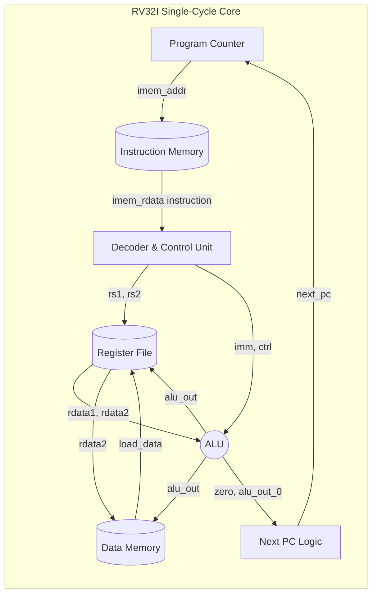

# Agentic RAG Pipeline for RISC-V RTL Generation

This project implements an Agentic Retrieval-Augmented Generation (RAG) pipeline to automatically synthesize, compile, and verify a **Single-Cycle RV32I RISC-V Processor** using LLMs and an automated feedback loop.

## Architecture

The system consists of two primary architectural domains: the Agentic Pipeline Architecture and the Generated Hardware Architecture.

### System Architecture

The python pipeline (`rag_pipeline.py`) orchestrates the generation and verification process:



### Hardware Architecture

The core generated by the system is a **Single-Cycle RV32I Processor** implemented within `rv32i_core.v`. All stages from fetch to write-back complete within one clock cycle, omitting complex pipelining logic to maintain a lightweight, fast, and easily verifiable footprint.



## Highlights
- **Semantic AST-Aware Chunking:** Parses structural verilog to maintain logical scope instead of naive token splitting, storing code chunks bounded by `module/endmodule`.
- **Agentic Auto-Fixer:** Automatically catches Verilator `-Wall` warnings and compilation errors, parsing `stderr` back into the LLM as an auto-correction prompt iteratively.
- **Single-Cycle Core Design:** Provides a highly verifiable and robust RISC-V base integer subset (RV32I) execution model processing 42 official specification benchmarks per cycle without hazard disruptions.
- **Accurate C++ Testbench Modeling:** Supports stable combinatorial delay simulation handling exact evaluations across asynchronous data boundaries during Verilator simulation.

## Usage
Simply run the RAG pipeline:
```bash
python rag_pipeline.py
```

This sequence will:
1. Initialize the **SemanticHardwareRetriever** to build TF-IDF dense embeddings.
2. Generate base architecture RTL using Gemini APIs.
3. Call **Verilator** in an isolated container to attempt hardware synthesis.
4. Auto-repair RTL logic errors utilizing the built-in feedback system.
5. Generate official test instruction binaries and simulate execution outputting the final report to `src/test_results.txt`.
